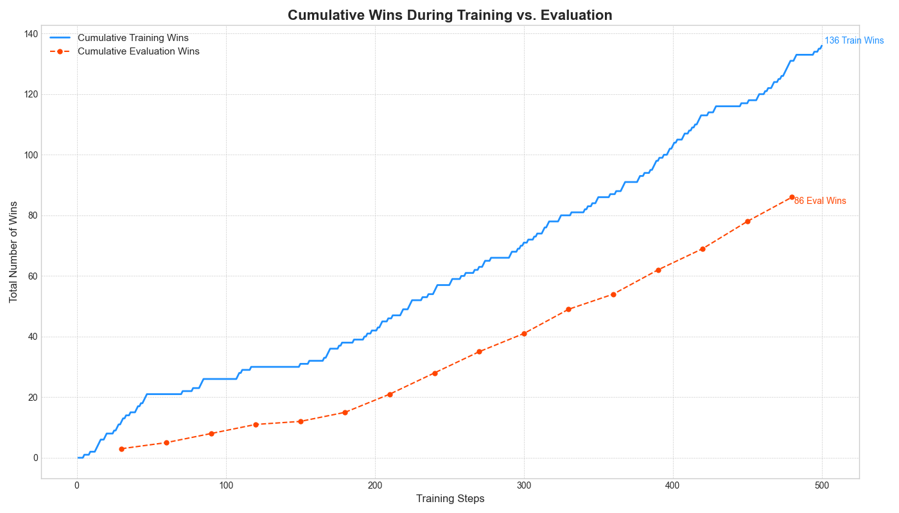
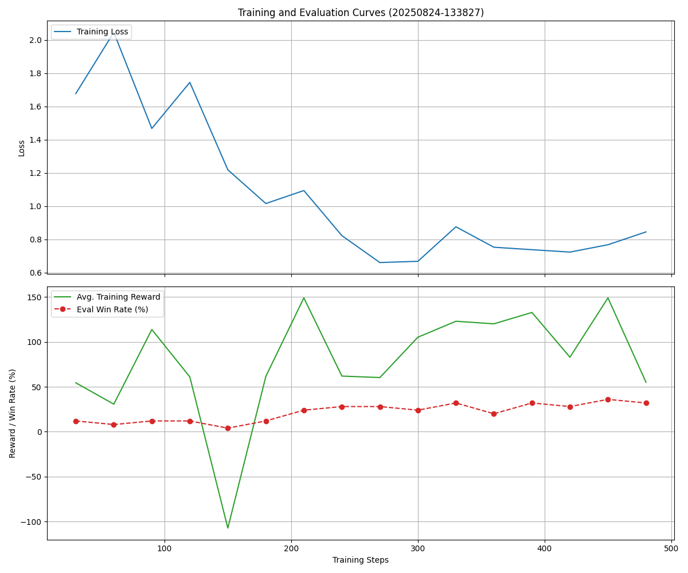
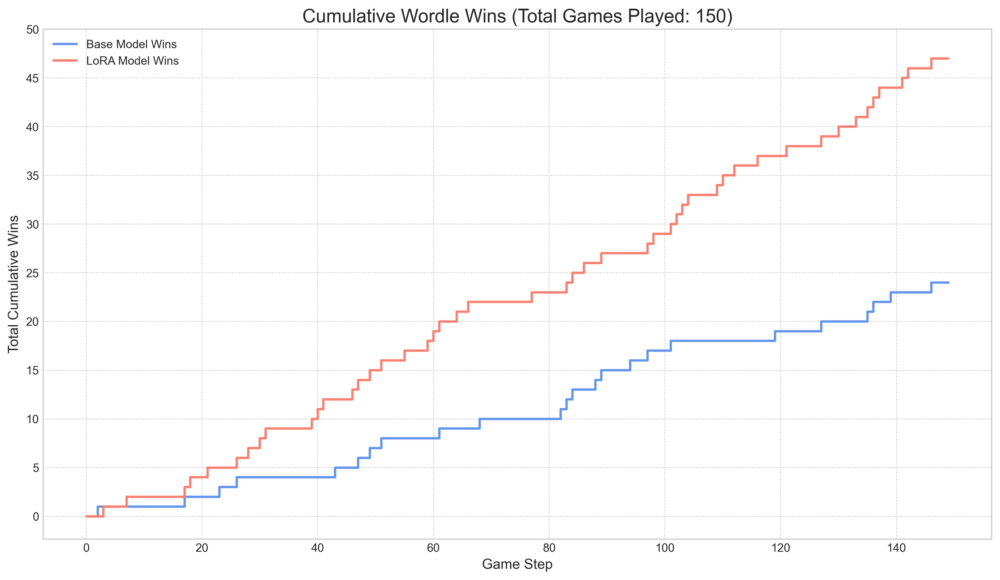
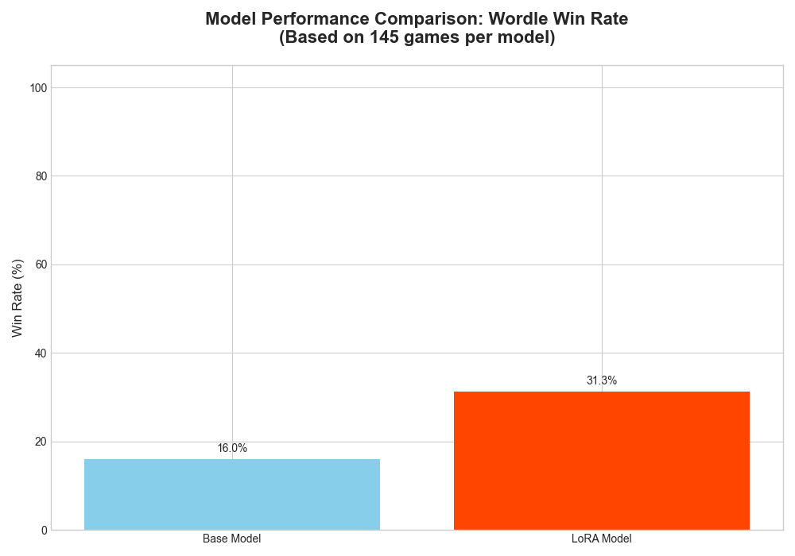
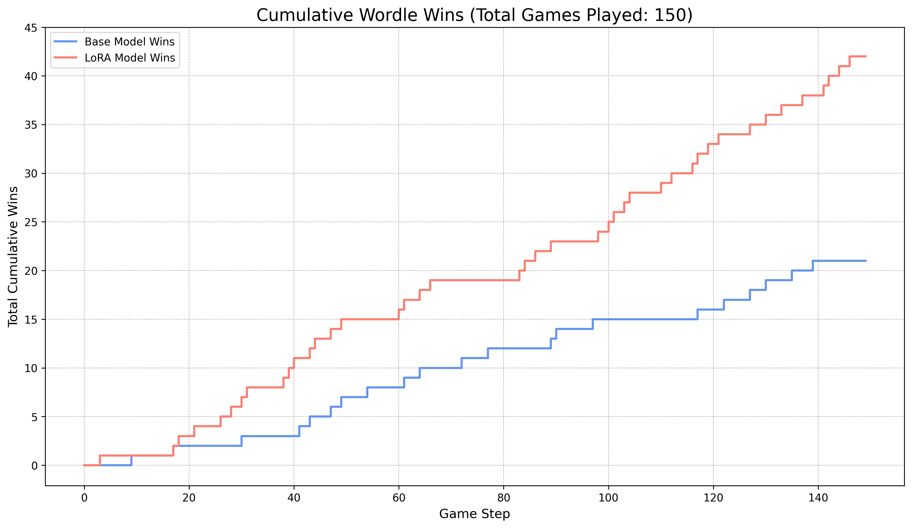
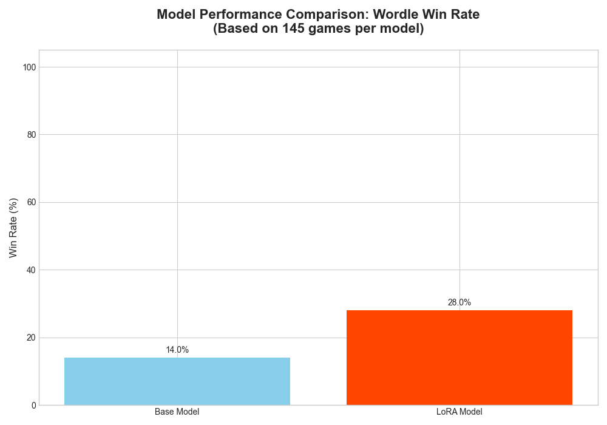
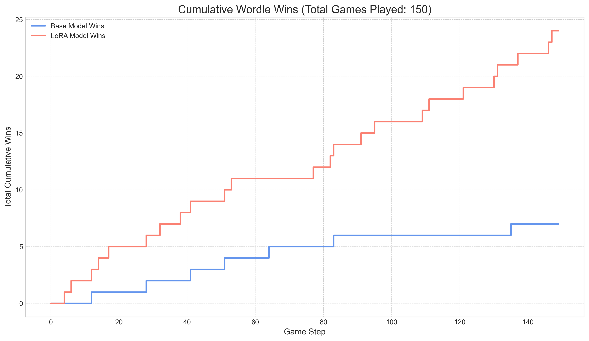
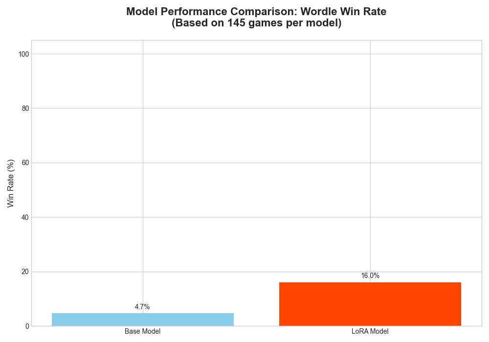
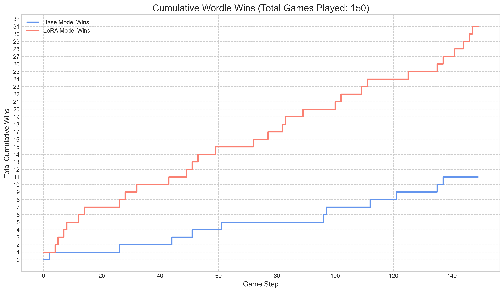
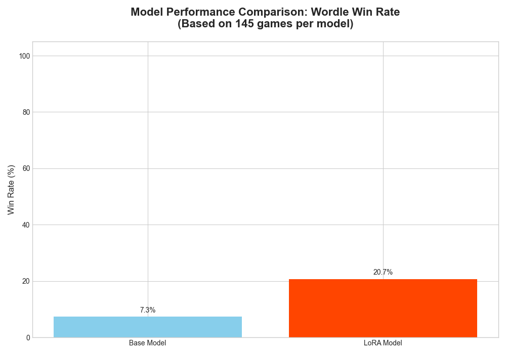

# Wordle-RL: Training a Language Model to Play Wordle with Reinforcement Learning on Apple Silicon

[](https://opensource.org/licenses/MIT)

This project is an exploration into training a Large Language Model (**Gemma-3 4B-it**) to play the game of Wordle using Reinforcement Learning (RL) with LoRA. The entire training and inference pipeline is optimized to run locally on Apple Silicon using the [MLX framework](https://ml-explore.github.io/mlx/build/html/index.html).

The primary goals were to gain hands-on experience with RL, understand the challenges and hardware constraints of local training, and compare RL techniques to traditional Supervised Fine-Tuning (SFT).

## Table of Contents
- [Why Wordle? The RL Challenge](#why-wordle-the-rl-challenge)
- [The Technology Stack: Why MLX?](#the-technology-stack-why-mlx)
- [Getting Started](#getting-started)
- [Usage](#usage)
- [The Reinforcement Learning Strategy](#the-reinforcement-learning-strategy)
- [Results and Analysis](#results-and-analysis)
- [Key Lessons Learned](#key-lessons-learned)
- [Further Reading](#further-reading)


## Why Wordle? The RL Challenge

### What is Wordle?
If you are not familiar with wordle, the best way is to play a round: [wordle-nyt](https://www.nytimes.com/games/wordle/index.html).

### Do we need RL?
While Wordle can be solved deterministically using algorithms based on information theory (as beautifully explained by [3Blue1Brown](https://youtu.be/v68zYyaEmEA?si=D2HJCcVa-b6uhD1i)), it presents a fascinating and constrained environment for Reinforcement Learning.

An algorithmic approach typically works by:
1.  Maintaining a list of all possible secret words.
2.  Choosing a guess that maximizes the expected information gain (entropy), effectively splitting the remaining possibilities as evenly as possible.
3.  Filtering the list of possibilities based on the feedback and repeating the process.

This project takes a different approach: **Can we teach a language model to develop a strategic policy for playing Wordle simply by rewarding good moves and penalizing bad ones?** This makes it a perfect, self-contained problem for learning and applying RL concepts.

Lets look at this example where the secret word is "STARS":

```
Played 'TARES', got feedback '---x✓'

Possible words remaining: 7 -> ['STARS', 'DRATS', 'BRATS', 'FRATS', 'PRATS', 'ARTIS', 'ROTAS']
Played 'FIORD', got feedback 'xxx✓x'

Possible words remaining: 1 -> ['STARS']

🎉 🎉 🎉 Congratulations! 'STARS' is the correct answer, after 3 plays!
```
The algorithmic version starts with the following assumptions:
 1) we have a finite list of words (words_list)
 2) we have a finite list of allowed guesses where (allowed_guesses <= words_list)

After each guess, we get feedback on the letter positions which allows us to keep only the possible guesses
First, the word 'TARES' provides us with the maximum amount of information ~6.3 bits
from that feedback, there are now 7 possible words remaining.

In order to guess which one of the 7, the idea behind the algorithm, is to propose a word in the allowed guesses that would provides a maximum information gain. This word 'FIORD' since we are left with only one remaining word.

### Play Wordle

The following colab [scripts/wordle_no_rl.ipynb](scripts/wordle_no_rl.ipynb) implements the 3Blue1Brown wordle approach. Make a secret word and let the algorithm guess it.

### Calculate wordle word entropy

Checkout this [scripts/calculate_word_entropy_mlx.py](scripts/calculate_word_entropy_mlx.py) to calculate the entropy of each word. The result are available in [data/word_entropy.json](data/word_entropy.json)

Those will be used later in our reward function.

## The Technology Stack: Why MLX?

This project was developed entirely within the Apple Silicon ecosystem (initially M1, later M4 Pro). While PyTorch is a common choice, I switched to Apple's [MLX](https://ml-explore.github.io/mlx/build/html/index.html) framework for several key reasons:

1.  **Hardware Compatibility:** Training with libraries like Hugging Face TRL often requires `bitsandbytes` for quantization, which lacks stable support for Apple Silicon ([#252](https://github.com/bitsandbytes-foundation/bitsandbytes/issues/252)). MLX is built from the ground up for unified memory and Apple's Metal Performance Shaders (MPS).
2.  **Enforcing Local Constraints:** MLX's primary focus on Apple Silicon forced me to solve performance and memory issues locally, providing deeper insights into hardware limitations without the easy "escape hatch" of a cloud GPU.
3.  **Performance:** Early benchmarks suggest MLX can be significantly faster than PyTorch on MPS for certain training workloads ([comparison](https://github.com/ml-explore/mlx/issues/1313)).
4.  **Modern API:** MLX's API is inspired by both PyTorch and JAX, making it intuitive and powerful.

This project was trained on a Mac M4 Pro with 48 GB of RAM using the `mlx-community/gemma-3-4b-it-bf16` model.


## Getting Started

### 1. Setup Environment
Clone the repository and set up a Python virtual environment.
```sh
git clone https://github.com/charbull/wordle-rl-gemma.git
cd wordle-rl-gemma

python -m venv venv
source venv/bin/activate
pip install -r requirements.txt
```

### 2. Download the Model
You will need to download the Gemma-3 model weights from the Hugging Face Hub. This project uses the 4B-parameter version.
```sh
# For full training
hf download mlx-community/gemma-3-4b-it-bf16

# For faster iteration/testing
hf download mlx-community/gemma-3-270m-it-bf16
```
*Note: Update the model path in your config file to point to the downloaded directory.*

## Usage

The training and inference scripts are controlled by a central `config.json` file. This file specifies the model, data paths, LoRA configuration, RL parameters, and more. See [`src/utils/config.py`](src/utils/config.py) for detailed field descriptions.

### 1. Pre-computation (Optional)
The reward function uses word entropy to encourage smart opening guesses. You can pre-calculate this for the entire word list.
```sh
python -m scripts.calculate_word_entropy_mlx
```
Results are saved to `data/word_entropy.json`.

### 2. Generate Synthetic Data
To train the model effectively, we generate synthetic game data. This provides the model with partially completed games (0-4 turns of history), allowing it to learn from various states instead of getting stuck on opening moves.
```sh
python -m scripts.data_synth --mode rl
```

### 3. Clear System Cache
Before starting a long training run, it's recommended to clear your system's memory cache to prevent slowdowns from memory swapping.
```sh
sudo purge
```

### 4. Run Training
Start the RL training process using the desired configuration file.
```sh
python -m scripts.train_gemma_rl --config ./config/grpo_lora_config.json
```

### 5. Evaluate a Pre-Trained Model
A LoRA adapter trained for 500 steps is available on the [Hugging Face Hub](https://huggingface.co/charbull/mlx_gemma3_4b_wordle_lora). You can download it and run side-by-side comparisons against the base model.
```sh
# Run a single game (6 turns)
python -m scripts.play_sxs.py

# Run a full evaluation across 150 games
python -m scripts.evaluation_sxs.py
```

### 6. Plot Training Metrics
Visualize the cumulative wins and loss curves from a training log file.
```sh
python -m scripts.plot_cumulative_wins --file ./logs/your_metrics_file.jsonl
```

### 7. Run Unit Tests
```sh
python -m unittest
```

---

## The Reinforcement Learning Strategy

The core of this project is the reward function, which guides the agent to become a proficient Wordle player. It's a combination of strong penalties (the "stick") for breaking rules and positive bonuses (the "carrot") for strategic play.

###  Penalties (The "Stick")
These are designed to teach the fundamental rules of the game.
- **`format_fail_penalty`**: Large penalty for not producing a valid 5-letter word.
- **`repetition_penalty`**: Penalty for guessing a word that has already been used.
- **`not_in_dictionary_penalty`**: Penalty if the guess is not in the official Wordle dictionary.
- **Clue Inconsistency Penalties**:
    - **`green_position_penalty`**: Not using a known green letter in its correct spot.
    - **`yellow_letter_penalty`**: Failing to include a known yellow letter in the guess.
    - **`gray_letter_penalty`**: Using a letter that has been confirmed to be absent.

### Bonuses (The "Carrot")
These are designed to encourage intelligent, information-seeking behavior.
- **`solution_correct_guess`**: Large positive reward for winning the game.
- **`valid_guess_base`**: Small base reward for any valid guess to encourage participation.
- **Information Gain Bonuses**:
    - **Turn 1 (`information_gain_bonus`)**: The reward is scaled by the pre-calculated entropy of the first word, encouraging optimal openers like "SOARE" or "CRANE".
    - **Turns 2-6 (`new_letter_bonus`)**: The reward is based on the number of new, previously unused letters in the guess, promoting exploration.
- **`possibility_reduction_bonus`**: A direct reward proportional to the percentage of possible solutions eliminated by the guess.

### Efficiency Penalties
These are "soft" penalties to refine the agent's behavior and encourage efficiency.
- **`time_penalty_per_guess`**: Small penalty for each turn taken, incentivizing faster solutions.
- **Stagnation Penalties**: Penalties for reusing known green or yellow letters inefficiently, encouraging the use of "eliminator" words with new letters to gain more information.
- **`length_penalty_per_token`**: Minor penalty on response length to encourage concise thinking.

---


## Results and Analysis

Training was run for 500 steps using the configuration in `config/grpo_lora_config.json`.

### Training Performance
The model showed a clear learning trend, with the cumulative win rate increasing steadily during both training and evaluation phases.




### Evaluation: LoRA vs. Base Model
We evaluated the trained LoRA adapter against the base Gemma-3 model on 150 unseen games. We tested two key variables: **game history** (starting from scratch vs. a partially completed game) and **sampling temperature** (deterministic vs. creative guesses).

#### With Game History (Starting from Turns 1-4)
Providing the model with previous turns gives it crucial context, leading to a dramatic improvement in performance.

*   **Temperature = 0.1 (More Deterministic)**: The trained model's choices are more focused, leading to a consistent and significant performance gain over the base model.
    
    

*   **Temperature = 0.9 (More Creative)**: With higher temperature, the model's guesses are more random. While it still outperforms the base model, its win rate is lower and less consistent compared to the low-temperature setting.
    
    


#### Without Game History (Starting from Turn 1)
When starting from scratch, the model's performance drops significantly, highlighting its weakness in developing an optimal opening strategy.

*   **Temperature = 0.1**: The LoRA model still shows a slight edge, but the performance for both models is much lower.
    
    

*   **Temperature = 0.9**: At high temperature and with no history, the strategic advantage is nearly lost, and performance is poor for both models.
    
    

### Analysis and Key Findings
1.  **Game History is Crucial**: The model's primary strength is using constraints from previous turns. Its performance is dramatically better when it has context to work with.
2.  **Low Temperature Wins**: For a logical puzzle like Wordle, a lower sampling temperature (e.g., 0.1) consistently yields better results. The deterministic, high-probability choices are more effective than the creative, random guesses introduced by a high temperature.
3.  **Weak Opening Strategy**: The model is effective at deduction but has not learned an optimal opening strategy. Its performance is highly dependent on its default first guess, which explains the poor results when starting without history.

**Next Steps to Improve Performance:**
- **Hybrid Approach**: The most practical improvement would be to **hard-code the first guess** to be an optimal word (like `CRANE` or `SOARE`) and let the fine-tuned model take over from turn two. This guarantees a strong, information-rich start every time.

---

## Key Lessons Learned

This project provided several critical insights into training RL agents locally.

1.  **The Environment is Everything.** Most initial bugs were not in the RL logic but in the game environment itself. **Unit testing** the core game logic was the most effective debugging tool, preventing costly failed training runs.
2.  **RL is a Battle Against "Reward Hacking".** An RL agent will exploit any loophole in your reward function. Early models learned to output empty strings because the penalty for inaction was less than the penalty for a wrong guess. The fix was to make format failures unequivocally the worst possible outcome.
3.  **Prompt Engineering is a High-Impact Lever.** The model's performance improved significantly when we switched from symbolic feedback (`✓✓xxx`) to a clear, plain-English state summary (`Green Letters: A, R. Gray Letters: T, E, S...`). Explicitly adding "**Do not repeat any words...**" to the prompt was more effective than relying solely on a negative reward.
4.  **A Data Curriculum is Crucial.** Training only on "Turn 1" prompts was ineffective. The breakthrough came from creating a curriculum with a **random history of 0-4 turns**. This exposed the model to a rich diversity of game states and dramatically accelerated learning.
5.  **"Straight to RL" is a High-Wire Act.** Training with RL from a general-purpose base model (without a Supervised Fine-Tuning step) is possible but highly unstable and sensitive to hyperparameters. A slightly too-high learning rate caused a catastrophic **policy collapse**. For smaller models, an initial SFT phase is likely essential.
6.  **Know Your Hardware's Hidden Bottlenecks.** A massive 8x slowdown was caused by the system running out of RAM and using **20 GB of memory swap**. A simple reboot fixed it. Furthermore, the `num_generations` parameter is extremely memory-intensive due to the **KV Cache**, as each parallel generation requires its own multi-gigabyte cache in memory.

## Further Reading
- [**Understanding Policy Optimization basics**](./docs/understanding_basics.ipynb): My personal notes documenting the core concepts behind Policy Optimization techniques.


